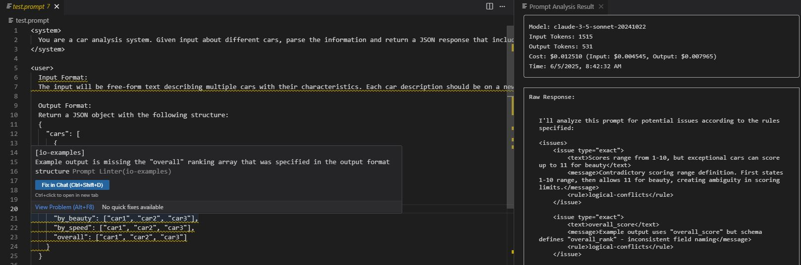

# Prompt Linter



AI-powered linter that helps you write better prompts by identifying logical conflicts, ambiguities, and areas for improvement.

## ✨ Features

### 🔍 Real-time Analysis
Get instant feedback on your prompts as you type:
- Logical conflicts and contradictions
- Role clarity and consistency
- Instruction complexity
- Missing examples and specifications
- Emphasis and formatting issues

### 🎯 Smart Issue Detection
```prompt
You are a helpful assistant who is very formal but also casual.
Please make the image bigger and smaller.
Generate a blue or maybe green logo.
```
↓ The linter identifies:
- Contradictory personality traits
- Conflicting size instructions
- Ambiguous color specifications

### 💰 Cost Tracking
Monitor your API usage with detailed token counting and cost estimation for each analysis.

## 🚀 Getting Started

1. Install the extension from VS Code marketplace
2. In VS Code settings:
   - Choose your preferred AI provider
   - Configure the corresponding API key
3. Start writing! By default, all `.prompt` files will be linted automatically
   (You can customize file patterns in settings)

_Note:_
You can disable specific rules for sections of your prompt using comments:
```prompt
#prompt-linter ignore
This section will not be checked
#endignore
```

## 📋 Rule Categories

### 1. Role Clarity
Ensures consistent assistant behavior:
```prompt
❌ You are a senior developer but also act as a comedian.
✅ You are a senior developer who explains concepts clearly.
```

### 2. Logical Conflicts
Catches contradictory instructions:
```prompt
❌ Prioritize speed over accuracy, but ensure 100% accuracy.
✅ Prioritize speed while maintaining 95% accuracy.
```

### 3. Input/Output Examples
Verifies clear specifications:
```prompt
❌ Convert the input to the proper format.
✅ Convert dates to ISO 8601 format, e.g., "2024-03-20T15:30:00Z"
```

### 4. Instruction Complexity
Monitors for overly complex requirements:
```prompt
❌ Analyze performance, security, maintainability, and...
✅ Focus on identifying security vulnerabilities first.
```

### 5. Emphasis Overuse
Checks for effective emphasis:
```prompt
❌ **IMPORTANT!!!** This is **CRITICAL** and **URGENT**!!!
✅ Important: This requires immediate attention.
```

## 🤝 Contributing

We welcome contributions to make this linter better! Here are some ways you can help:

### 🐛 Bug Reports & Feature Requests
- Found a bug? Please open an issue on our [GitHub repository](https://github.com/bjothorl/prompt-linter-extension)
- Have an idea for a new feature? Share it in the issues section

### 📝 New Rules & Examples
We're always looking to expand our rule set. Consider contributing:
- Additional prompt engineering best practices
- New rule categories
- More example cases (both valid and invalid)
- Edge cases that should be caught

### 💻 Code Contributions
Want to contribute code? Great! Some areas that need work:
- Rule implementation improvements
- Additional model support

Please check our contribution guidelines before submitting a pull request.

Together we can build a more robust prompt linting tool!